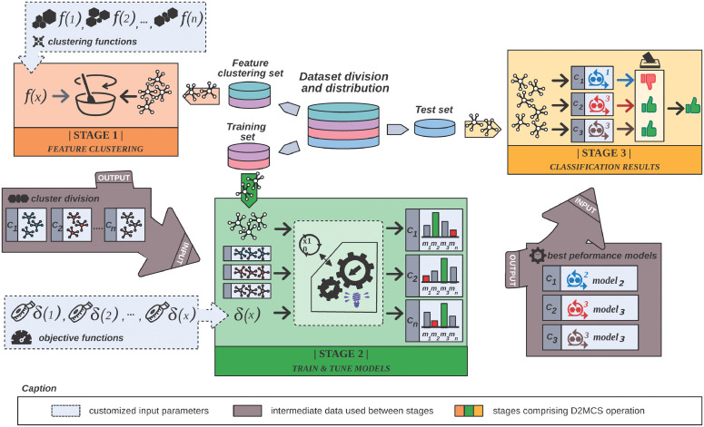

# D2-MCS toolkit: Drugs Discover Multi-Clustering System

R framework to automatically predict the biological activity of chemical compounds regarding to theirs chemical substructures

## Operation mode




## Required libraries

### On linux (Ubuntu)

* r-base
* r-base-core

### On Windows

Download from CRAN Project: https://cran.r-project.org/bin/windows/

## R required packages

|             |            | R Libraries |            |            |
|-------------|------------|-------------|------------|------------|
|R6           |car         |plyr         |dplyr       |caret       |
|mltools      |here        |parallel     |RWeka       |devtools    |
|ModelMetrics |tools       |graphics     |gridExtra   |grid        |
|lattice      |rJava       |FSelector    |BBmisc      |ggalt       |
|tictoc       |ggrepel     |ggplot2      |reshape2    |            |

## Execution example (get classification performance)

```R
source("sources.R")
data <- Dataset$new( filepath ="<path_to_dataset_file>", header=TRUE, 
                     sep="\t",skip = 1, normalize.names=TRUE, classIndex = 1 )
data$executePartition(4)
  
trFunction <- TwoClass$new( method = "cv", number = 10, savePredictions = "final", 
                            classProbs = TRUE, allowParallel = TRUE, verboseIter = FALSE)
  
fisherC <- BinaryFisherClustering$new(dataset = data$getSubset(1,2), maxClusters = 50)
fisherC$execute(positive.class = "<value_positive_class>")
train.subset <- fisherC$createSubset( subset = data$getSubset(c(2,3)) )
test.subset <- data$getSubset(4)
  
Benchmarking <- D2MCS$new( path = "models/BinaryFisherCluster", trainFunction = trFunction )
Benchmarking$train( train.set = train.subset, metric = "MCC" )
classify <- Benchmarking$classify( test.set = test.subset), voting.scheme = ClassWeightedVoting$new(), 
                                   positive.class = "<value_positive_class>" )
classify$computePerformance( ob = test.subset$getClass(), list(MCC$new(), PPV$new(), Accuracy$new()) )
  
```
Output visualization example


|   |  Measure |   Value   |
|---|----------|-----------|
| 1 |      MCC | 0.7858148 | 
| 2 |     PPV  | 0.8864542 |
| 3 | Accuracy | 0.8928571 |

## Execution example (execute NSGAII and SMSEMOA optimization algorithms)

```R
optimization <- Benchmarking$optimize( opt.set = test.subset, 
                                       voting.scheme = ClassWeightedVoting$new(), 
                                       opt.algorithm = list(NSGAII$new( min.function  = FPFN$new(), 
                                                                        n.generations = 25000,
                                                                        n.iteractions = 1 ),
                                                            SMSEMOA$new( min.function = FPFN$new(), 
                                                                         n.generations = 25000,
                                                                         n.iteractions = 1 ) ), 
                                       positive.class = "<value_positive_class>" )
```

## Developers
[David Ruano Ordás](http://drordas.info)

## Citation

To cite **D2-MCS** please use:
> Ruano-Ordás, D.; Yevseyeva, I.; Basto-Fernandes, V.; Méndez, José R.; Emmerich, Michael T.M. (2018). 
> Improving the drug discovery process by using multiple classifier systems
> Expert Systems with Applications. Volume 121, pp. 292-303.
> Elsevier. https://doi.org/10.1016/j.eswa.2018.12.032

> Ruano-Ordás, D.; Burggraaff, L.; Liu, R.; van der Horst, C; Heitman, L.H.; Emmerich, Michael T.M.; Mendez, José R.; Yevseyeva, I; Van Westen,G. (2019) 
> A Multiple Classifier System Identifies Novel Cannabinoid CB2 Receptor Ligands.
> Journal of Cheminformatics. Volume 11, Article 66.
> Biomedcentral. https://doi.org/10.1186/s13321-019-0389-9
